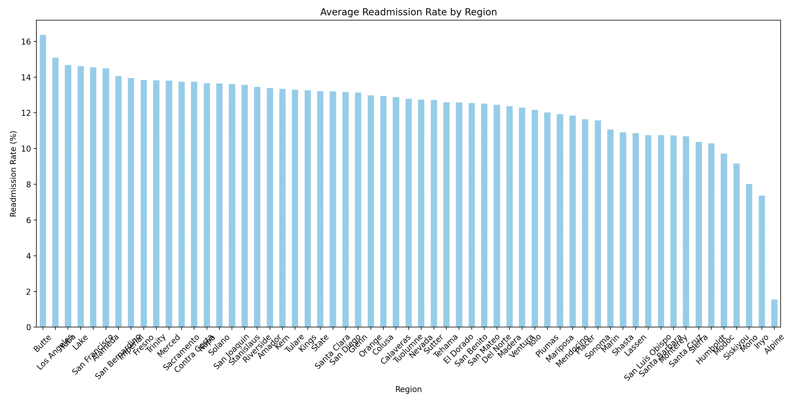
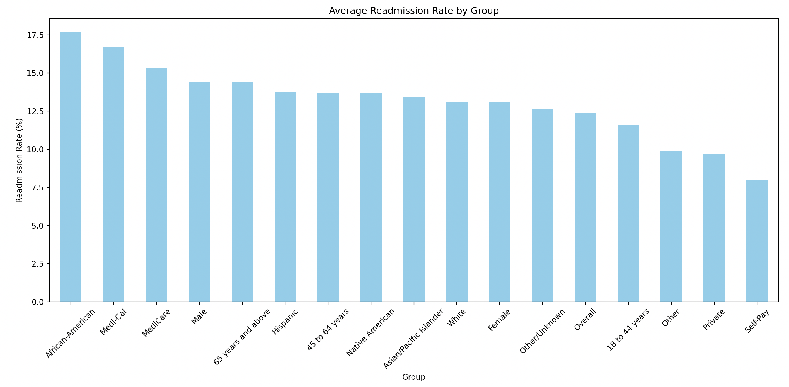

# Hospital Readmission Analysis (California 30-Day All-Cause)

## Section 1. The Business Goal

The objective of this project is to identify which California counties and patient demographic groups experience the highest 30-day hospital readmission rates. By uncovering these patterns, healthcare leaders can implement targeted interventions to reduce readmissions, improve quality of care, and lower costs associated with preventable inpatient stays.

---

## Section 2. Data Source

- **Dataset**: All-Cause Unplanned 30-Day Hospital Readmission Rate (California)
- **Publisher**: California Health & Human Services (CHHS)
- **Data Portal**: [https://data.chhs.ca.gov](https://data.chhs.ca.gov)
- **Download Method**: Manually downloaded CSV file placed in `data/raw/` folder

---

## Section 3. Tools Used

- **Python 3.13**
- **pandas** – Data manipulation and cleaning
- **matplotlib & seaborn** – Data visualization
- **requests** – (Originally intended for downloading the dataset)
- **VS Code** – IDE for development
- **Git & GitHub** – Version control and collaboration

---

## Section 4. Workflow & Logic

1. **Data Download**:
   - Dataset downloaded manually and stored in `data/raw/hospital_readmission_ca.csv`.

2. **Data Cleaning**:
   - Selected key columns: year, strata type (age, gender, race, payer), county, and readmission rate.
   - Cleaned and renamed columns to match analysis logic.
   - Removed rows with missing values and standardized readmission rate as a float.

3. **Analysis**:
   - Grouped by **County** to calculate average regional readmission rate.
   - Grouped by **Strata Name** to analyze demographic patterns (e.g., Age 65+, Male, Medicare).

4. **Visualization**:
   - Bar charts created for:
     - **Average readmission rate by region**
     - **Average readmission rate by group (demographic/payer)**
   - Charts displayed using `matplotlib` with consistent styling.

---

## Section 5. Results (Narrative + Visualizations)

### Readmission Rate by Region (County)

  
- **Highest rates**: Butte, Los Angeles, Lake, Fresno, and San Bernardino
- **Lowest rates**: Alpine, Modoc, Siskiyou, Humboldt, Trinity

### Readmission Rate by Demographic Group

  
- **Highest rates**: African-American, Medi-Cal (Medicaid), Medicare, Male, 65+ age group
- **Lowest rates**: Self-pay, Private insurance, Age 18–44

### Key Findings:
- **Older adults, publicly insured patients, and African-American patients** face disproportionately high readmission rates.
- **Urban counties** exhibit higher average readmission rates than rural or frontier counties.

---

## Section 6. Suggested Business Action

- **For County Health Systems**:
  - Prioritize post-discharge planning and follow-up in counties like Los Angeles, Fresno, and San Bernardino.
  - Deploy community health outreach programs in counties with high disparities.

- **For Hospitals**:
  - Implement enhanced care transition models (e.g., nurse navigators, automated discharge follow-up).
  - Review discharge procedures for Medi-Cal and Medicare patients.

- **For Policy Makers**:
  - Explore incentive models for reducing readmissions among high-risk populations.
  - Invest in telehealth and community-based chronic disease management programs.

---

## Section 7. Challenges

- **Dataset Structure**: The original dataset did not include separate columns for age or gender; instead, it used a stratified “Group” format.
- **Download Automation**: Attempts to automate the download failed due to rotating/expired URLs from the CHHS portal.
- **Limited Variables**: Length of stay, diagnosis codes, and cost were not available, which limits the depth of causal analysis.

---

## Section 8. Ethical Considerations

- **Health Equity**: This analysis highlights disparities by race, age, and insurance status. Any intervention must ensure equitable treatment and not penalize institutions serving vulnerable populations.
- **Data Privacy**: The dataset used is anonymized and aggregate-level. No patient-level information was accessed.
- **Bias in Data**: Results may reflect systemic issues in healthcare delivery, and conclusions should be framed as insight for improvement, not as individual or institutional fault.

---

## How to Run the Project

1. Clone this repository:
```bash
git clone https://github.com/krofkr/hospital_readmission_analysis.git